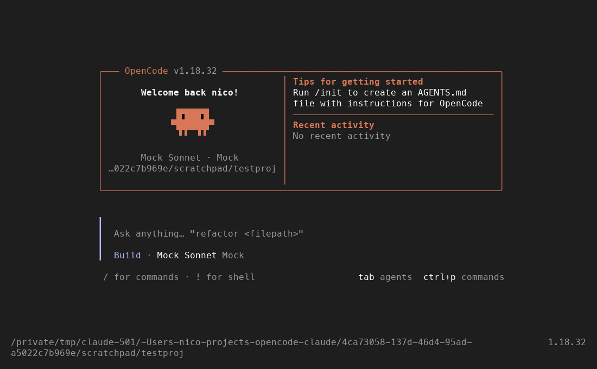
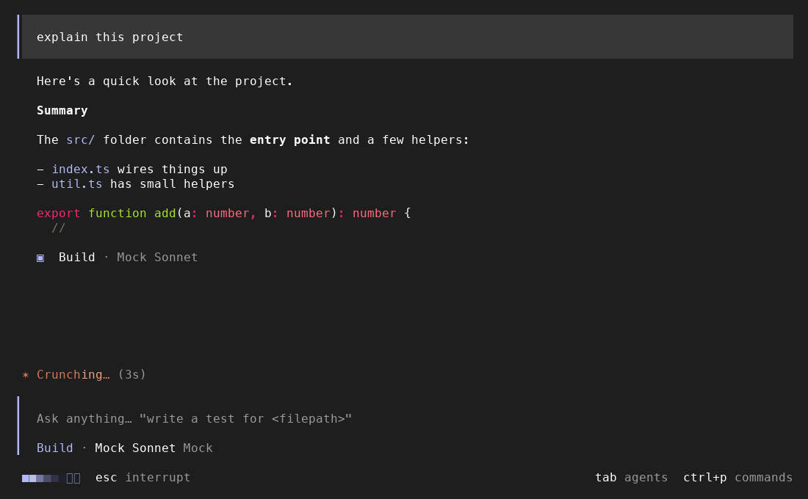
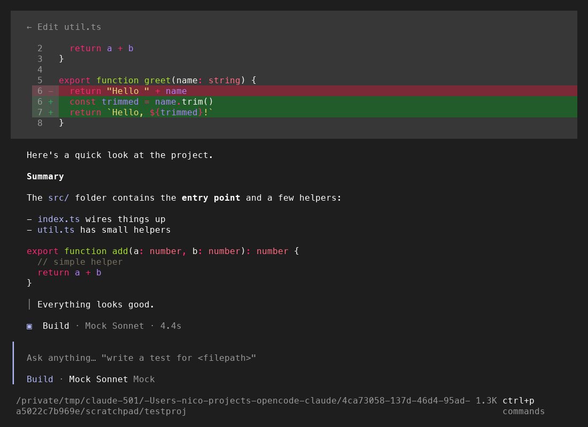
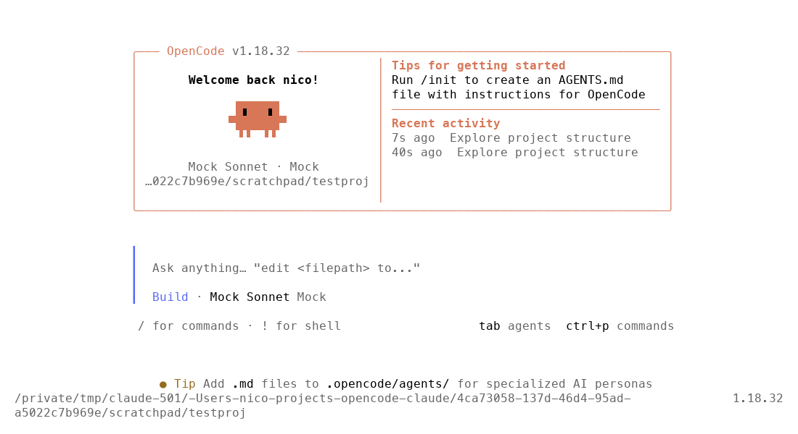

# opencode-claude-style

A cosmetic theme and TUI plugin that makes [OpenCode](https://opencode.ai) look
like Claude Code, so it feels familiar if you're used to Claude Code.

It changes appearance only. OpenCode's commands, keybinds, agents, and tools all
work exactly as before. None of Claude Code's features are copied.



| Session (busy)                                | Diffs                               | Light mode                                        |
| --------------------------------------------- | ----------------------------------- | ------------------------------------------------- |
|  |  |  |

## What you get

| Piece | What it changes |
| --- | --- |
| **`claude-code` theme** | Claude Code's dark and light palettes: brand orange `#D77757`, the gray user-message background, the lavender accent used for inline code and links, success/error/warning colors, diff backgrounds, Monokai Extended (dark) and GitHub (light) syntax colors. The background is transparent, so your terminal's background shows through as it does in Claude Code. |
| **Welcome banner** | Replaces the OpenCode logo with Claude Code's welcome box: an orange rounded border with the name and version in the top edge, "Welcome back *name*!", **Clawd**, your model and directory, plus "Tips for getting started" and "Recent activity" (your latest OpenCode sessions). Below 64 columns it switches to Claude Code's compact three-line header. |
| **Clawd** | Drawn from the same quadrant-block characters Claude Code uses (`▐▛███▜▌` / `▝▜█████▛▘` / `▘▘ ▝▝`), with black eyes. |
| **Prompt** | Sits at the bottom of the home screen, as it does in a session, and spans the full terminal width between two horizontal rules, like Claude Code's input. It starts with Claude Code's `❯` (`!` in shell mode) instead of OpenCode's colored bar, has no filled background, and uses Claude Code-style placeholder suggestions (`"fix lint errors"`, `"how does <filepath> work?"`, …). OpenCode's agent and model row is removed from inside the prompt, and OpenCode's startup tip moves above it. |
| **Mode line** | The bottom line, under the prompt: `⏵⏵ build mode on (tab to cycle)` or `⏸ plan mode on (tab to cycle)`, in the agent's color, like Claude Code's `⏸ plan mode on (shift+tab to cycle)`. Other agents get `⏵⏵`, shell mode shows `! shell mode on`, and the key shown is whatever `agent.cycle` is bound to. The model isn't shown, as in Claude Code. |
| **Spinner line** | While a session is working, shows `✻ Pondering… (12s · ↓ 1.2k tokens · thinking)` above the prompt, timed from your message, with `⎿  Tip: …` underneath. The glyph cycles through `· ✢ ✳ ✶ ✻ ✽`, the verb is picked at random from a whimsical list, and a highlight sweeps across it. `thinking` shows while the model is reasoning. The tips are OpenCode's own. OpenCode's own progress indicator is still there. |
| **Usage line** | Left of `ctrl+p commands` under the prompt, OpenCode's `15.9K (8%)` becomes `14.9k \| ctx 25% \| 5h: 48% \| 7d: 6%`: the session's tokens, how full the context is, and, when you're signed in with a ChatGPT Plus/Pro or Claude Pro/Max subscription, how much of its 5-hour and 7-day limits you've used. In a narrow terminal it drops the token count, then the cost, the context, and the 7-day limit to fit. |
| **Transcript** | Your earlier prompts show as `❯ text` on a gray band instead of in a box with a colored bar. Replies start with `⏺`, and while one streams only its finished lines show, so prose arrives a paragraph at a time instead of word by word, as in Claude Code. Runs of reads, searches, shell commands, and web fetches fold into one line. While the run is going, a dim `⏺` blinks beside `Listing 1 directory, running 2 shell commands…` (or the running command's description, if the model gave one), with `⎿  $ npm test` underneath. The line stays put between calls instead of flickering, and each command stays up for at least 0.7s so you can read it. Once the reply moves on, it becomes a dim `Listed 1 directory, ran 2 shell commands`. Shell commands that only list, read, or search (`ls`, `cat`, `grep`, …) count as such, as Claude Code counts them. Thinking is hidden, and the spinner line says when the model is thinking. <kbd>ctrl+o</kbd> expands everything to OpenCode's full view, with thinking shown, and collapses it again. OpenCode's `▣ Build · model · 12s` line after each reply becomes `✻ Worked for 12s · done 4:00 PM` (the verb varies, as in Claude Code), or `⎿  Interrupted · What should OpenCode do instead?`. |
| **Agent colors** (optional server plugin) | Build uses lavender. Plan uses teal, like Claude Code's plan mode. Without this, OpenCode colors agents by their position in the list, and plan comes out yellow. |

## Install

Requires OpenCode **1.18** or later; tested with 1.18.32. TUI plugins and
`oc-themes` are loaded by OpenCode's Bun runtime, so there's no build step.

### Try it without changing your config

```sh
./scripts/preview.sh            # same as `opencode`, with this plugin layered on
./scripts/preview.sh ~/my/repo  # extra arguments are passed through to opencode
```

This uses `OPENCODE_TUI_CONFIG` and `OPENCODE_CONFIG` to add the plugin on top of
your existing config. Your providers, auth, and keybinds still apply. Your config
files aren't touched, but OpenCode does copy `claude-code.json` into
`~/.config/opencode/themes/` when the plugin loads.

### Install permanently

Clone this repo somewhere, then point OpenCode at the folder.

**`~/.config/opencode/tui.json`** holds the theme, banner, prompt, spinner, and transcript:

```jsonc
{
  "$schema": "https://opencode.ai/tui.json",
  "theme": "claude-code",
  "plugin": ["/absolute/path/to/opencode-claude"]
}
```

**`~/.config/opencode/opencode.json`** is optional and only sets agent colors:

```jsonc
{
  "$schema": "https://opencode.ai/config.json",
  "plugin": ["/absolute/path/to/opencode-claude"]
}
```

The first time the plugin loads, OpenCode copies `themes/claude-code.json` into
its themes folder. If `tui.json` doesn't already set a theme, the plugin also
switches to `claude-code` that first time only. After that, `/themes` (or
<kbd>ctrl+x t</kbd>) switches themes as usual.

To use **only the theme**, copy `themes/claude-code.json` into
`~/.config/opencode/themes/` and set `"theme": "claude-code"`.

## Options

Pass options with OpenCode's `[spec, options]` plugin syntax:

```jsonc
// tui.json
{
  "plugin": [
    ["/absolute/path/to/opencode-claude", { "name": "Nico", "spinner": false }]
  ]
}
```

| Option | Default | Effect |
| --- | --- | --- |
| `banner` | `true` | Replace the OpenCode logo with the welcome banner and Clawd, and remove OpenCode's home footer (directory and version, which the banner already shows). |
| `prompt` | `true` | Full-width prompt between rules, Claude Code-style placeholders, and the mode line. |
| `spinner` | `true` | Show the `✻ Pondering… (12s · ↓ 1.2k tokens)` line and a tip while a session is busy. With `transcript` off, the line becomes `✻ Worked for 12s · done 4:00 PM` once the turn is done. |
| `transcript` | `true` | Restyle and pace the session transcript: `❯` prompts, `⏺` replies shown a finished line at a time, folded tool calls with <kbd>ctrl+o</kbd> to expand, thinking hidden until <kbd>ctrl+o</kbd>, and `✻ Worked for 12s · done 4:00 PM` after each reply. |
| `usage` | `true` | Show `14.9k \| ctx 25% \| 5h: 48% \| 7d: 6%` under the prompt. The 5h and 7d parts need a ChatGPT or Claude subscription login (see below). |
| `name` | `username` from config, then your OS user | The name in "Welcome back *name*!". |
| `activateTheme` | `true` | Switch to `claude-code` on first load if `tui.json` sets no theme. |

The server plugin in `opencode.json` takes one option: `agentColors`
(default `true`). It never overrides a `color` you've set on an agent yourself.

## Subscription limits

OpenCode doesn't track 5-hour and 7-day limits, so the plugin asks the provider,
the way Codex's `/status` and Claude Code's `/usage` do. It does this only when
the session's model comes from `openai` or `anthropic` and OpenCode's
`auth.json` holds an OAuth login (not an API key) for that provider. The login
is sent only to the provider it belongs to (`chatgpt.com` or
`api.anthropic.com`). It is fetched when the session opens, after each turn (at
most every 30 seconds), and every 5 minutes. The plugin never refreshes a login
itself: if it has expired, the limits are left out until OpenCode refreshes it.
Any other provider, or a failed request, just leaves them out. These endpoints
aren't documented, so a provider could change them without notice.

## Color mapping

| Claude Code | OpenCode theme key | Dark | Light |
| --- | --- | --- | --- |
| `claude` (brand, Clawd) | `primary`, `borderActive` | `#D77757` | `#D77757` |
| `text` / `inactive` | `text` / `textMuted` | `#FFFFFF` / `#999999` | `#000000` / `#666666` |
| `promptBorder` / `subtle` | `border` / `borderSubtle` | `#888888` / `#505050` | `#999999` / `#AFAFAF` |
| `userMessageBackground` | `backgroundPanel`, `backgroundMenu` | `#373737` | `#F0F0F0` |
| `suggestion` / `permission` | `secondary`, markdown code and links | `#B1B9F9` | `#5769F7` |
| `planMode` | `accent` | `#48968C` | `#006666` |
| `success` / `error` / `warning` | same names | `#4EBA65` / `#FF6B80` / `#FFC107` | `#2C7A39` / `#AB2B3F` / `#966C1E` |
| `diffAdded` / `diffRemoved` | `diffAddedBg` / `diffRemovedBg` | `#225C2B` / `#7A2936` | `#69DB7C` / `#FFA8B4` |
| `diffAddedDimmed` / `diffRemovedDimmed` | `diff*LineNumberBg` | `#47584A` / `#69484D` | `#C7E1CB` / `#FDD2D8` |
| `diffAddedWord` / `diffRemovedWord` | `diffHighlight*` | `#38A660` / `#B3596B` | `#2F9D44` / `#D1454B` |

## Known differences

These parts of OpenCode's UI aren't exposed to plugins, so they keep their
OpenCode styling:

- The prompt keeps OpenCode's `Ask anything… "…"` placeholder prefix.
- Plugins can't configure the prompt, the home screen's layout, or the
  transcript, so the plugin finds the parts it changes in the rendered layout:
  the agent and model row (hidden, and read to get the current agent), the
  colored bar (blanked, with `❯` drawn over it), the home screen's spacers and
  tip (rearranged so the prompt sits at the bottom), and the transcript's rows
  (recognized by what OpenCode draws in them). If a future OpenCode version
  changes that layout, those parts stay as OpenCode draws them and the mode line
  stays empty, rather than anything breaking. Hiding the agent row also hides
  the model variant (reasoning effort) and the `auto` permissions tag.
- The transcript is restyled just before each frame is drawn, by hooking into
  OpenCode's renderer. Reply text is held back by wrapping the markdown's text
  setter, since OpenCode sets it on every token.
- Only reads, searches, shell commands, web fetches, web searches, and skills
  fold into summary lines. Edits, writes, subagents, todos, questions, other
  tools, and failed or denied calls keep OpenCode's style, as do all tool calls
  once expanded with <kbd>ctrl+o</kbd>. There are no `⏺ Bash(…)` / `⎿` result
  lines.
- <kbd>ctrl+o</kbd> switches OpenCode's thinking display (`/thinking`) on while
  expanded, and back off when collapsed or when OpenCode exits.
- The token count in the spinner line is estimated from the text streamed so
  far, until OpenCode reports the real count at the end of each step.
- While a session is busy, OpenCode shows its own `esc interrupt` indicator where
  the mode line is, so the mode line comes back when the turn finishes.
- OpenCode's `tab agents` and `ctrl+p commands` hints stay at the right of the mode line.
- The home prompt ignores OpenCode's default 75-column cap so it can span the
  terminal. If you set `prompt.max_width` in `tui.json`, that value is respected,
  and the welcome banner and prompt use it instead.
- The rules are drawn only while the theme leaves the prompt unfilled (as
  `claude-code` does). Under a theme with a filled prompt, the fill already shows
  its width.
- Shell mode (`!`) uses the theme's primary orange rather than Claude Code's
  pink bash border.
- OpenCode's startup tips are kept, just above the prompt.

## Development

```sh
npm install        # type definitions only; OpenCode provides the runtime
npm run typecheck
bun test           # or, without Bun installed: BUN_BE_BUN=1 opencode test
```

Layout:

```
themes/claude-code.json  the OpenCode theme (registered through "oc-themes")
src/tui.tsx              TUI plugin entry: registers slots, reads options
src/welcome.tsx          welcome banner and compact header
src/clawd.tsx            Clawd
src/prompt.tsx           prompt wrappers and the spinner line
src/transcript.tsx       transcript restyling and the ctrl+o key
src/tree.ts              helpers for finding parts of OpenCode's rendered layout
src/usage.tsx            the usage line under the prompt
src/limits.ts            5-hour and 7-day limits for ChatGPT and Claude subscriptions
src/palette.ts           Claude Code colors with no theme key, spinner glyphs, verbs, and tips
src/format.ts            pure helpers (model label, durations, turn timing, tool summaries)
src/server.ts            optional server plugin that sets agent colors
scripts/preview.sh       run OpenCode with the plugin, without editing config
```

The plugin fills OpenCode's `home_logo`, `home_footer`, `home_prompt`, and
`session_prompt` slots. The prompt slots render OpenCode's own `api.ui.Prompt` with different
props, so input handling, autocomplete, and keybinds are OpenCode's.
